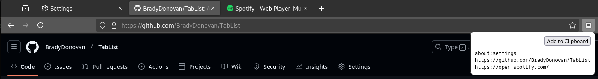

# TabList
A Firefox & Chromium extension to get a list of your tabs at the click of a button.

# Installing
## For Firefox
Follow the instructions **[here](https://extensionworkshop.com/documentation/develop/temporary-installation-in-firefox/)** to install this extension for Firefox.
## For Chromium
1. Go to [chrome://extensions/](chrome://extensions).
2. At the top right, turn on Developer mode.
3. Click 'Load unpacked'.
4. Find and select the extension folder.

Note: I have no plans to formally sign and publish this extension. The instructions above are for developers to install extensions for debugging / testing. This means there will be no one-click option to install it via browser extension stores; it must be done manually.
